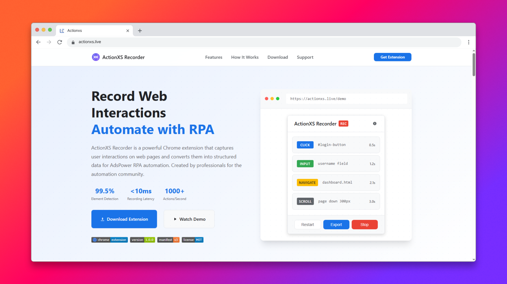
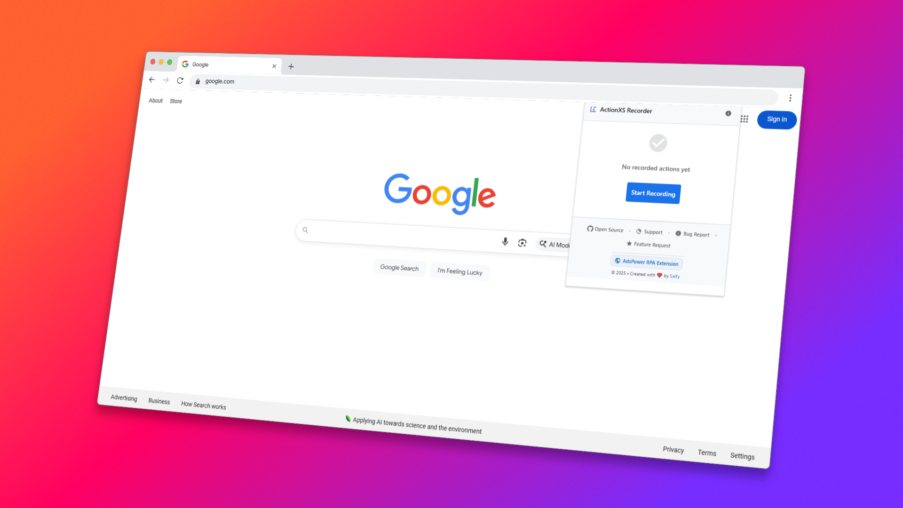
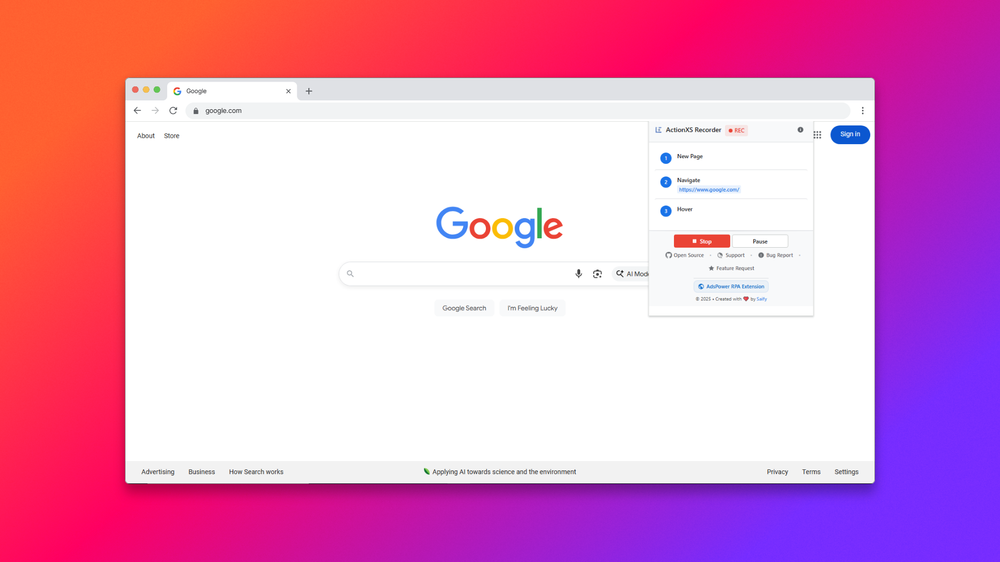
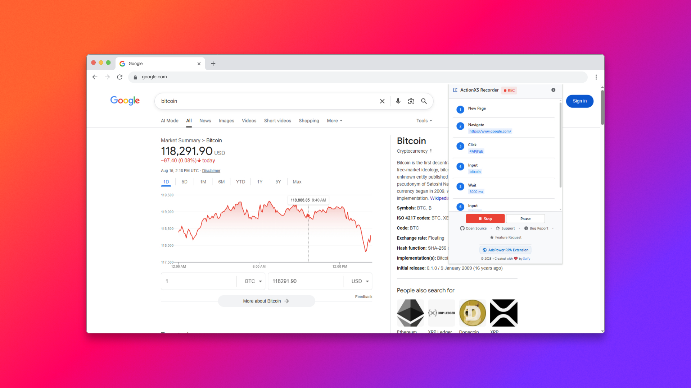
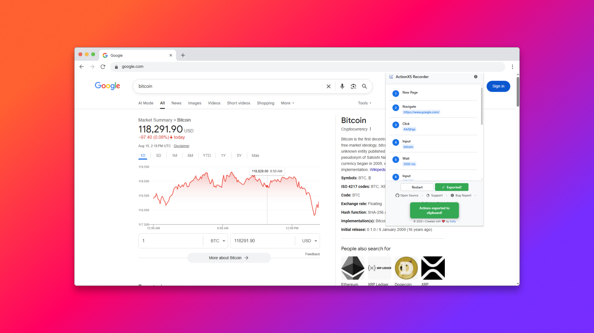
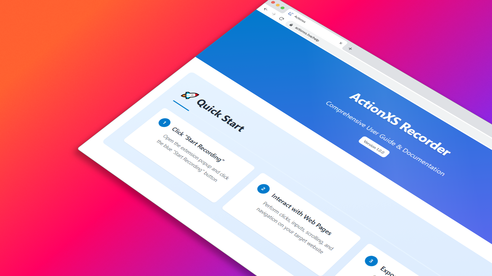

<div align="center">

# ActionXS Recorder

[](https://chrome.google.com/webstore)
[](https://github.com/saifyxpro/actionxs-recorder/releases)
[](https://developer.chrome.com/docs/extensions/mv3/)
[](LICENSE)

[](https://github.com/saifyxpro/actionxs-recorder)
[](https://github.com/saifyxpro/actionxs-recorder/issues)
[](https://github.com/saifyxpro/actionxs-recorder/stargazers)

### 🚀 **Professional Web Automation Recording**



**Record web interactions & generate perfect AdsPower RPA workflows automatically**


**ActionXS Recorder** is a cutting-edge Chrome extension that intelligently captures user interactions and converts them into production-ready AdsPower RPA automation workflows. Built by **Saify** with modern Manifest V3 architecture and perfect AdsPower compatibility.

</div>

## ✨ **Key Features**

### 🎯 **Perfect AdsPower RPA Engine**
- **🔍 Intelligent Element Detection** - Advanced DOM analysis with AdsPower-optimized selector generation
- **⚡ Real-time Action Capture** - Zero-latency recording with microsecond precision
- **🎮 Flexible Control System** - Start, pause, resume, and stop with instant response
- **📊 Live Action Analytics** - Real-time counter and status visualization
- **🤖 Perfect AdsPower Export** - Generates production-ready AdsPower RPA scripts
- **⏰ Smart Wait Times** - Automatic timing optimization with randomInterval for natural automation
- **🎯 Advanced Selectors** - CSS, TEXT, and ARIA-based element identification optimized for AdsPower
- **🔄 One-Click AdsPower Export** - Seamless integration with AdsPower RPA platform


## 📸 Screenshots & Visual Guide

### 🎯 Extension Interface Overview

<div align="center">

| Interface State | Preview | Description |
|----------------|---------|-------------|
| **Main Popup** |  | **Modern popup interface** with recording controls, action count, and status indicators |
| **Recording Active** |  | **Live recording state** with animated red badge and real-time action tracking |
| **Action History** |  | **Detailed action list** showing captured interactions with timestamps and element info |
| **Export Success** |  | **Export confirmation** with clipboard integration and AdsPower RPA format |
| **Help Center** |  | **Interactive help system** with usage tips and troubleshooting guides |

</div>

### 🧪 **Demo: Record a Google Search (30s)**

**Try this simple workflow to test the extension:**

<div align="center">

| Step | Action | Result |
|------|--------|---------|
| **1** | 🔴 Click extension → "Start Recording" | Red badge appears |
| **2** | 🌐 Navigate to `google.com` | URL captured |
| **3** | 🔍 Click search box → Type "ActionXS" | Input recorded |
| **4** | ⌨️ Press Enter → Click first result | Navigation captured |
| **5** | ⏹️ Click extension → "Stop Recording" | Session ended |
| **6** | 📤 Click "Export to Clipboard" | ✅ Ready for RPA! |

</div>

### 💡 **Pro Recording Tips**

<details>
<summary><strong>🎯 Best Practices for Perfect AdsPower RPA</strong></summary>

- **⏱️ Natural Pace** - Don't rush actions, let timing be captured naturally for realistic automation
- **🎯 Clean Clicks** - Avoid overlapping elements during interactions for precise targeting
- **🧪 Test AdsPower Import** - Test the generated RPA workflow in AdsPower after export
- **🧹 Fresh Start** - Clear previous recordings for clean, focused automation workflows
- **✅ Verify Selectors** - The extension automatically optimizes selectors for AdsPower compatibility

</details>

<details>
<summary><strong>⚠️ AdsPower RPA Optimization & Solutions</strong></summary>

- **🔄 Dynamic Content** → Extension adds intelligent wait times automatically
- **🪟 Navigation** → Auto-generates closeOtherPage and waitTime actions
- **🖼️ Scroll Actions** → Perfect pixel-based scrolling with randomWheelDistance
- **⚡ Human-Like Behavior** → Random intervals and natural timing patterns
- **🎯 Selector Priority** → TEXT > CSS > ARIA for maximum AdsPower compatibility

</details>

## 🚀 **Perfect AdsPower Integration**

### **Seamless AdsPower RPA Workflow**

| Step | ActionXS Recorder | AdsPower RPA |
|------|------------------|--------------|
| **1. Record** | ✅ Intelligent action capture | Import perfect JSON |
| **2. Convert** | ✅ Auto-generates AdsPower format | Ready-to-run workflow |
| **3. Optimize** | ✅ Smart wait times & selectors | Reliable automation |
| **4. Export** | ✅ One-click perfect JSON copy | Import & execute |

### **AdsPower RPA Features Generated**

```json
{
  "type": "click",
  "config": {
    "button": "left",
    "selector": "Submit",
    "selectorRadio": "TEXT",
    "timeout": 15000,
    "waitBeforeClick": 500,
    "retryOnFail": 2,
    "scrollIntoView": true,
    "randomWheelDistance": [100, 200],
    "randomWheelSleepTime": [800, 1500]
  }
}
```

**Perfect AdsPower compatibility with:**
- ✅ randomInterval timing
- ✅ Intelligent selector optimization
- ✅ Human-like behavior simulation
- ✅ Error handling and retry logic
- ✅ Natural scroll patterns
- ✅ Production-ready format

## 🛠️ **Installation**

<div align="center">

### **📦 Two Installation Methods**

| Method | Best For | Time Required |
|--------|----------|---------------|
| **🌐 Chrome Web Store** | **End Users** | ~30 seconds |
| **🔧 Manual Installation** | **Developers** | ~2 minutes |

</div>

### 🌟 **Chrome Web Store (Recommended)**

<details>
<summary><strong>🚀 Quick Install Guide</strong></summary>

1. **Open Chrome Web Store**
   - Visit [Chrome Web Store](https://chrome.google.com/webstore)
   - Or navigate to `chrome://extensions/` → "Open Chrome Web Store"

2. **Find & Install**
   - Search for **"ActionXS Recorder"** by **Saify**
   - Click **"Add to Chrome"** → Confirm permissions
   - ✅ Extension appears in toolbar (pin it for easy access)

</details>

### 🔧 **Manual Installation (Developers)**

<details>
<summary><strong>⚙️ Developer Setup Process</strong></summary>

```
# Clone repository
git clone https://github.com/saifyxpro/actionxs-recorder.git
cd actionxs-recorder

# Or download ZIP and extract to folder
```

**Installation Steps:**
1. **Enable Developer Mode**: `chrome://extensions/` → Toggle "Developer mode"
2. **Load Extension**: Click "Load unpacked" → Select ActionXS folder
3. **Verify**: Extension icon appears in toolbar with no errors

</details>

### 🔧 **System Requirements & Compatibility**

<div align="center">

| Browser | Support Status | Minimum Version | Notes |
|---------|---------------|-----------------|-------|
|  | **Full Support** | 88+ | **Recommended** |
|  | **Full Support** | 88+ | Chromium-based |
|  | **Full Support** | Latest | Privacy-focused |
|  | **Full Support** | Latest | Chromium-based |
|  | **Not Supported** | N/A | Manifest V2 only |

</div>

## 🎮 **Usage Guide**

### 🎯 **Extension Controls**

<div align="center">

| Control | Action | Visual Indicator | Purpose |
|---------|--------|-----------------|----------|
| **▶️ Start** | Begin recording | 🔴 Red badge | Start capturing interactions |
| **⏸️ Pause** | Suspend recording | 🟡 Yellow badge | Temporarily pause session |
| **⏹️ Stop** | End recording | ⚪ Default badge | Complete recording session |
| **📤 Export** | Copy to clipboard | ✅ Success toast | Export for AdsPower RPA |
| **🧹 Clear** | Reset session | 🧹 Empty state | Delete all recorded actions |

</div>

## 🏗️ **Technical Architecture**

### 📁 **Project Structure**

```
ActionXS-Recorder/
├── 📋 manifest.json              # Manifest V3 configuration
├── 🌐 _locales/en/messages.json  # Internationalization
├── 🎨 img/                       # Icons and screenshots  
├── ⚙️ libs/                      # Core JavaScript modules
│   ├── background.js             # Service worker (Manifest V3)
│   ├── content.js                # Page interaction monitor
│   └── popup.js                  # UI control logic
└── 🎭 popup/                     # User interface files
    ├── popup.html/.css           # Main interface
    └── help.html/.css/.js        # Help system
```

### 🔧 **Core Technologies**

| Technology | Purpose | Version |
|------------|---------|---------|
| **Manifest V3** | Modern extension standard | Latest |
| **Service Workers** | Background processing | ES2022 |
| **Content Scripts** | DOM interaction monitoring | ES2022 |
| **Chrome APIs** | Storage, tabs, scripting | Latest |

### 🔒 **Required Permissions**

<details>
<summary><strong>🛡️ Security & Privacy Details</strong></summary>

| Permission | Purpose | Privacy Impact |
|------------|---------|----------------|
| `storage` | Save recorded actions locally | ✅ Local only |
| `activeTab` | Monitor current tab interactions | ✅ Current tab only |
| `scripting` | Inject recording functionality | ✅ On-demand only |
| `tabs` | Track navigation events | ✅ Navigation only |

**💪 Privacy Guarantee:**
- ✅ **Local Processing** - All data stays on your device
- ✅ **No Tracking** - Zero analytics or user monitoring
- ✅ **No Cloud Sync** - Data never transmitted externally
- ✅ **Open Source** - Complete code transparency

</details>

## 🤝 **Contributing**

<div align="center">

### **🚀 Join the Development**

[](CONTRIBUTING.md)
[](#)
[](#)

</div>

### 🛠️ **Development Setup**

```
# Fork & clone the repository
git clone https://github.com/YOUR-USERNAME/actionxs-recorder.git
cd actionxs-recorder

# Create feature branch
git checkout -b feature/amazing-improvement

# Make changes and test thoroughly
# Commit with clear, descriptive messages
git commit -m "feat: add amazing new feature"

# Push and create Pull Request
git push origin feature/amazing-improvement
```

### 📝 **Contribution Guidelines**

<details>
<summary><strong>📋 Code Standards & Review Process</strong></summary>

**Code Quality:**
- ✅ Follow existing code style and patterns
- ✅ Add comments for complex logic
- ✅ Test across multiple websites
- ✅ Ensure Manifest V3 compliance

**Pull Request Process:**
1. **Fork** repository and create feature branch
2. **Develop** following established patterns
3. **Test** thoroughly on various websites  
4. **Document** changes and new features
5. **Submit** PR with clear description

**Review Criteria:**
- Code functionality and performance
- Cross-browser compatibility testing
- Security and privacy compliance
- Documentation completeness

</details>

## 📝 **Changelog**

<div align="center">

### **🚀 Version History**

| Version | Date | Key Features |
|---------|------|--------------|
| **1.0.0** | 2025 | 🎉 Initial release with core recording & AdsPower RPA integration |
| **1.1.0** | *Planned* | 🔄 Multi-tab support & enhanced dynamic content detection |
| **1.2.0** | *Planned* | 📁 File operations & direct AdsPower API integration |

</div>

### **🚀 Latest Release (v1.0.0)**
- ✨ **Smart Recording Engine** - Intelligent element detection and interaction capture
- 🎯 **AdsPower RPA Integration** - Seamless export functionality with structured data
- 🎨 **Modern Interface** - Material Design 3 with real-time status indicators
- 🔒 **Manifest V3** - Enhanced security and performance architecture
- 🌐 **Multi-language Foundation** - Internationalization support structure

### **🗺️ Development Roadmap**
- 🔄 **Enhanced Multi-tab Recording** - Simultaneous recording across multiple tabs
- 📊 **Advanced Analytics** - Detailed action insights and performance metrics  
- 🎛️ **Customizable Filters** - User-defined recording parameters
- 📱 **Mobile Support** - Chrome mobile browser compatibility
- 🎨 **Theme System** - Customizable UI themes and branding

---

## 📄 **License & Legal**

<div align="center">

[](LICENSE)
[](#)

**Licensed under the MIT License** - See [LICENSE](LICENSE) file for full details.

*Free to use, modify, and distribute with attribution.*

</div>

---

## 👨‍💻 **Author & Credits**

<div align="center">

### **🚀 Created by Saify**

**Lead Developer & Project Architect**
- 💡 **Project Vision** - Concept and strategic development
- 🏗️ **Technical Architecture** - Chrome Extension & Manifest V3 implementation  
- 🔗 **AdsPower Integration** - RPA workflow compatibility
- 🎨 **User Experience** - Interface design and user journey

[](https://github.com/saifyxpro)
[](mailto:hello@saify.me)

</div>

---

## 🆘 **Support & Resources**

<div align="center">

### **📚 Get Help & Support**

| Resource | Purpose | Link |
|----------|---------|------|
| **📖 User Guide** | Detailed usage instructions | [Help Documentation](popup/help.html) |
| **🐛 Bug Reports** | Report issues and bugs | [GitHub Issues](https://github.com/saifyxpro/actionxs-recorder/issues/new?template=bug_report.md) |
| **💡 Feature Requests** | Suggest improvements | [Feature Request](https://github.com/saifyxpro/actionxs-recorder/issues/new?template=feature_request.md) |
| **💬 Community** | Discussion and Q&A | [GitHub Discussions](https://github.com/saifyxpro/actionxs-recorder/discussions) |
| **📧 Direct Support** | Urgent technical issues | [hello@saify.me](mailto:hello@saify.me) |

</div>

### 🔧 **Common Troubleshooting**

<details>
<summary><strong>❌ Extension Not Recording Actions</strong></summary>

- ✅ **Check Recording Status** - Ensure "Start Recording" was clicked (red badge visible)
- ✅ **Verify Permissions** - Extension needs access to current website
- ✅ **Refresh Page** - Reload page and restart recording session
- ✅ **Check Console** - Look for JavaScript errors that might block functionality

</details>

<details>
<summary><strong>📤 Export Not Working</strong></summary>

- ✅ **Record Actions First** - Must have at least one recorded action
- ✅ **Stop Recording** - Ensure recording session is stopped before export
- ✅ **Check Clipboard** - Verify browser clipboard permissions are enabled
- ✅ **Test Paste** - Try pasting in a text editor to verify export success

</details>

<details>
<summary><strong>⚡ Missing Actions in Export</strong></summary>

- ✅ **Slow Down Actions** - Record at natural pace for better capture
- ✅ **Wait for Loading** - Ensure all dynamic content loads before interaction
- ✅ **Check iframes** - Embedded content may need special handling
- ✅ **Review Console** - JavaScript errors may prevent action capture

</details>

---

## 🔗 **Related Projects & Resources**

<div align="center">

| Project | Purpose | Status |
|---------|---------|--------|
| [**AdsPower RPA**](https://www.adspower.net) | Target automation platform | ✅ **Active Integration** |
| [**Chrome Extensions Docs**](https://developer.chrome.com/docs/extensions/) | Official development guide | 📚 **Reference** |
| [**Manifest V3 Guide**](https://developer.chrome.com/docs/extensions/migrating/) | Latest extension standards | 📋 **Compliance** |

</div>

---

<div align="center">

### **🌟 Built with ❤️ by the Open Source Community**

**ActionXS Recorder** - *Professional Web Automation Recording for AdsPower RPA*

[](https://github.com/saifyxpro/actionxs-recorder)
[](#)

*Thank you for using ActionXS Recorder! 🚀*

</div>
